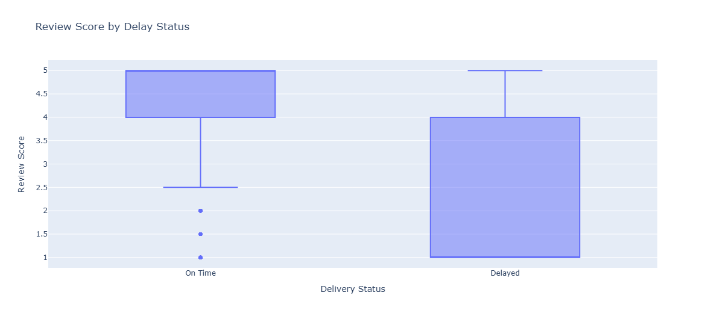
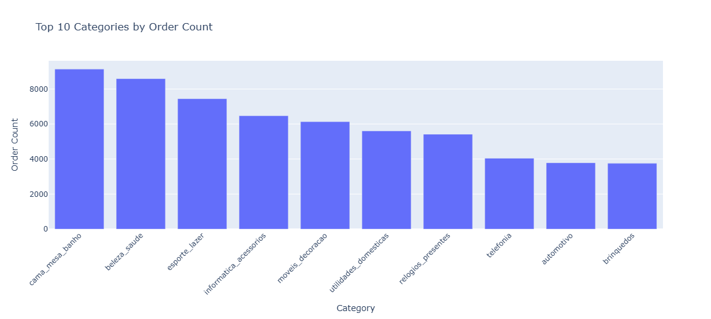
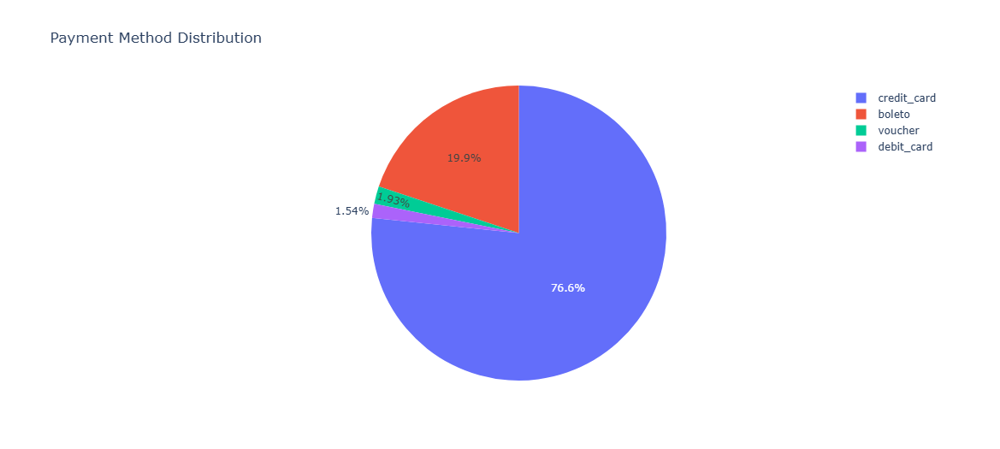

# Olist E-Commerce Data Analysis

## Project Overview
This project analyzes the Brazilian e-commerce dataset (Olist) to understand customer behavior, delivery performance, and key drivers of customer satisfaction.

The analysis includes data cleaning, relational data modeling, exploratory data analysis, and statistical testing to generate actionable business insights.

---

## Notebook
Open the full analysis here:
[Olist_analysis (1).ipynb](./Olist_analysis%20(1).ipynb)

---

## Dataset Description
The dataset consists of multiple relational tables:

- orders
- customers
- order items
- payments
- reviews
- products
- sellers

---

## Methodology

### Data Cleaning
- handled missing values carefully
- standardized categorical variables
- converted timestamp fields to datetime format

### Data Modeling
Due to one-to-many relationships (items, payments), direct joins would create duplicate rows.

To address this:
- item-level and payment-level tables were aggregated
- an order-level dataset was constructed

This ensured consistency and reliability in the analysis.

---

### Feature Engineering
The following features were created:

- order_value
- delivery_time_days
- delivery_delay_days
- is_delayed
- is_satisfied

---

### Exploratory Data Analysis
The analysis focused on:

- order value distribution
- delivery performance
- customer satisfaction
- product categories
- payment behavior

---

### Hypothesis Testing

The following statistical tests were applied:

- Independent T-Test (delivery speed vs satisfaction)
- Chi-Square Test (delay vs satisfaction)
- ANOVA (category vs order value)
- Chi-Square Test (payment type vs satisfaction)

---

## Key Insights

- Delayed deliveries are associated with lower customer satisfaction
- Delivery performance is a critical factor in user experience
- Product category significantly impacts order value
- Payment method has limited impact on satisfaction

---

## Example Visualization

### Review Score by Delay Status

### Top 10 Categories by Order Count

### Payment Method Distribution

---

## Tools Used

- Python (Pandas, NumPy)
- Plotly
- SciPy

---

## Next Steps

- customer segmentation
- predictive modeling
- retention analysis

---

## Author

This project was developed as part of a data analysis portfolio to demonstrate practical skills in data cleaning, analysis, and statistical reasoning.
